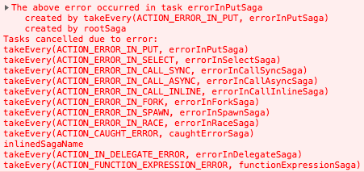
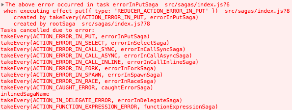
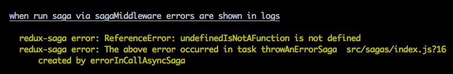

# Troubleshooting

### App freezes after adding a saga

Make sure that you `yield` the effects from the generator function.

Consider this example:

```js
import { take } from 'redux-saga/effects'

function* logActions() {
  while (true) {
    const action = take() // wrong
    console.log(action)
  }
}
```

It will put the application into an infinite loop because `take()` only creates a description of the effect. Unless you `yield` it for the middleware to execute, the `while` loop will behave like a regular `while` loop, and freeze your application.

Adding `yield` will pause the generator and return control to the Redux Saga middleware which will execute the effect. In case of `take()`, Redux Saga will wait for the next action matching the pattern, and only then will resume the generator.

To fix the example above, `yield` the effect returned by `take()`:

```js
import { take } from 'redux-saga/effects'

function* logActions() {
  while (true) {
    const action = yield take() // correct
    console.log(action)
  }
}
```

### My Saga is missing dispatched actions

Make sure the Saga is not blocked on some effect. When a Saga is waiting for an Effect to
resolve, it will not be able to take dispatched actions until the Effect is resolved.

For example, consider this example

```javascript
function* watchRequestActions() {
  while (true) {
    const {url, params} = yield take('REQUEST')
    yield call(handleRequestAction, url, params) // The Saga will block here
  }
}

function* handleRequestAction(url, params) {
  const response = yield call(someRemoteApi, url, params)
  yield put(someAction(response))
}
```

When `watchRequestActions` performs `yield call(handleRequestAction, url, params)`, it'll wait
for `handleRequestAction` until it terminates an returns before continuing on the next
`yield take`. For example suppose we have this sequence of events

```
UI                     watchRequestActions             handleRequestAction
-----------------------------------------------------------------------------
.......................take('REQUEST').......................................
dispatch(REQUEST)......call(handleRequestAction).......call(someRemoteApi)... Wait server resp.
.............................................................................
.............................................................................
dispatch(REQUEST)............................................................ Action missed!!
.............................................................................
.............................................................................
.......................................................put(someAction).......
.......................take('REQUEST')....................................... saga is resumed
```

As illustrated above, when a Saga is blocked on a **blocking call** then it will miss
all the actions dispatched in-between.

To avoid blocking the Saga, you can use a **non-blocking call** using `fork` instead of `call`

```javascript
function* watchRequestActions() {
  while (true) {
    const {url, params} = yield take('REQUEST')
    yield fork(handleRequestAction, url, params) // The Saga will resume immediately
  }
}
```

### Error stack for errors bubbling to root saga is unreadable
Tasks in saga are asynchronous by their nature, so we have to make some
additional work to show "saga stack" as it was a chain of synchronous calls. So staring with `redux-saga@v1`, when error bubbles to root saga, the library builds that "saga stack" and passes it as a property `sagaStack: string` of the second argument of `onError` callback (also see [Middleware options](https://redux-saga.js.org/docs/api/index.html#createsagamiddlewareoptions)), so you can send it to your error tracking system or make other additional work.

As a result, you can see something like this in your console.



If you want to have those "saga stack" with file names and line numbers for **development purposes**, you can add [babel-plugin](https://www.npmjs.com/package/babel-plugin-redux-saga), which allows you to have enhanced information.
Docs are available [here](../packages/babel-plugin-redux-saga).
For babel-plugin usage example check [this example](../examples/error-demo)

After adding `babel-plugin-redux-saga` the same output looks like



Note: [It works for testing as well](../examples/error-demo/test/sagas.js), just make sure you (or your runner) run saga via `sagaMiddleware`.


