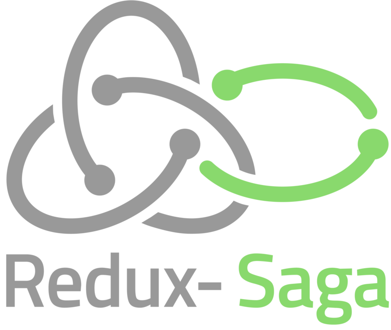
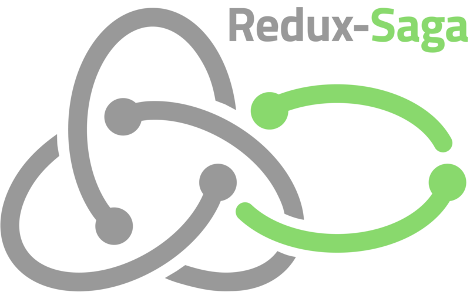

# The Redux-Saga Logo

This is the only official Redux-Saga logo. Don't use any other logos to represent Redux-Saga.

The logo comes in several flavors:

### Just the logo


### The logo with the name in landscape mode


### The logo with the name in portrait mode



### The logo with the name in compact mode



## Resolution

Two resolutions have been chosen: 

+ a width of [800px](0800/) which should suffice for most purposes and a 
+ width of [3840px](3840/), which you may want to downsample as needed.

## Color codes

```CSS
reduxSagaGray: #999999;
reduxSagaGreen: #89D96D;
```

## Font

The chosen font is [Titillium](https://fonts.google.com/specimen/Titillium+Web). The logo names for portrait and landscape are in Semi-Bold. The logo name for compact are in bold.

## Credits

The Redux-Saga logo was based on the original Redux logo designed by [Matthew Johnston](http://thedeskofmatthew.com/). The additions to reflect Redux-Saga was designed by @karland – [Karl Anders](http://webseiten-anders.de/).


## License 

The Redux logo is licensed under CC0, waiving all copyright.  
[Read the license.](../LICENSE-logo.md)